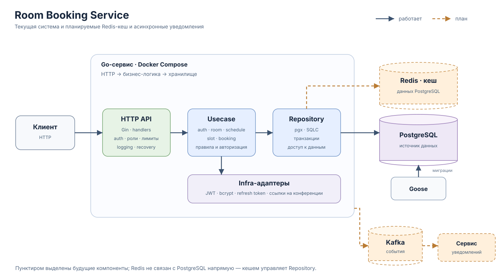

# Room Booking Service

## О проекте

Room Booking Service — backend для организации бронирования переговорных комнат. Администратор задаёт комнаты и правила их доступности, а сервис на их основе формирует слоты для выбранной даты и не позволяет нескольким пользователям забронировать одно и то же время.

Проект моделирует типичный внутренний сервис компании: пользователи бронируют подходящую переговорную, а администраторы управляют доступностью помещений.

## Статус проекта

Реализованы основной сценарий бронирования переговорных, HTTP API, аутентификация и ролевая авторизация пользователей. Проект покрыт unit-, repository integration-, HTTP integration/E2E- и конкурентными тестами; доступны также проверки с race detector и отчёт о покрытии. Категории тестов можно запускать отдельно локально и вручную в GitHub Actions.

В разработке:

- Кеширование через Redis.
- Observability: метрики, tracing, дашборды и алерты.
- DevOps-часть: автоматизация развёртывания и развитие CI/CD; ручной CI-запуск тестов уже настроен.
- Отдельный notifications-сервис с Kafka для асинхронной обработки событий бронирования.

## Возможности

- Регистрация и вход по email и паролю.
- Аутентификация через JWT access tokens, обновление токенов с ротацией refresh token.
- Управление сессиями: выход из текущей сессии или со всех устройств.
- Ролевой доступ: пользователь отменяет только свою бронь, администратор — любую.
- Создание комнат и повторяющихся расписаний администратором, просмотр комнат авторизованными пользователями.
- Генерация свободных 30-минутных слотов для выбранной даты при запросе.
- Создание и отмена бронирований, просмотр всей истории своих броней и общего списка с пагинацией для администратора.
- Опциональная локальная генерация ссылок на конференции.
- Контракт API: [api.yaml](api.yaml).

## Технологии

| Категория | Решения | Назначение |
| --- | --- | --- |
| Язык и HTTP | Go, Gin | Сервис и HTTP API |
| База данных | PostgreSQL, pgx | Хранение данных и работа с PostgreSQL |
| Схема и SQL | Goose, SQLC | Миграции и генерация типобезопасного Go-кода по SQL-запросам |
| Аутентификация | golang-jwt/jwt, bcrypt | Access JWT и хеширование паролей |
| Ограничение нагрузки | golang.org/x/time/rate | Лимитирование HTTP-запросов |
| Логирование | Zap | Структурированные логи с request-scoped полями |
| Тестирование | Go `testing`/`httptest`, Testify, GoMock | Unit-, repository integration- и HTTP integration/E2E-тесты |
| Проверка конкурентности | Go race detector | Поиск гонок при конкурентном выполнении |
| Запуск и CI | Docker Compose, GNU Make, GitHub Actions | Локальный запуск и ручной запуск категорий тестов в CI |

## Архитектура и ключевые решения



На схеме сплошные связи обозначают работающие компоненты одного Go-сервиса; пунктиром показано планируемое расширение. Kafka и сервис уведомлений пока не реализованы.

- **Слоистая архитектура.** Use case работают с бизнес-сущностями и не зависят от Gin, pgx и конкретных адаптеров; HTTP-слой и инфраструктура подключаются через интерфейсы уровня приложения.
- **Явные бизнес-зависимости.** Use case зависят от небольших интерфейсов уровня приложения; конкретные реализации PostgreSQL, password hashing, JWT и conference links собираются в `internal/app`.
- **PostgreSQL, Goose и SQLC.** Изменения схемы версионируются миграциями Goose, а SQLC генерирует типобезопасный Go-код по SQL-запросам. Ограничения БД защищают инварианты; известные ошибки PostgreSQL преобразуются в ошибки приложения на уровне репозиториев.
- **Транзакции для составных операций.** Создание расписания с правилами и получение страницы бронирований вместе с общим количеством выполняются через транзакционную абстракцию.
- **Слоты по запросу.** При первом запросе даты use case создаёт слоты по правилу расписания; повторная вставка не дублирует их. Для комнаты БД также запрещает пересекающиеся интервалы слотов.
- **Защита бронирований от гонок.** SQL не создаёт бронь для прошедшего слота, а частичный уникальный индекс допускает только одну активную бронь на слот. Отмена сохраняет запись в истории и вновь делает слот доступным.
- **Аутентификация и сессии.** Пароли хешируются bcrypt. Короткоживущий access JWT подписывается HS256 и проверяется по подписи, сроку действия, issuer и audience. Refresh token передаётся в HttpOnly cookie; в PostgreSQL хранится только его хеш. Обновление выполняется с атомарной ротацией refresh token. Выход отзывает серверную сессию и запрещает дальнейшее обновление токенов; уже выданный access token действует до истечения TTL.
- **Тестовый вход.** Маршрут `/dummyLogin` включён по умолчанию для локальной разработки; перед внешним развёртыванием его нужно отключить через `ENABLE_DUMMY_LOGIN=false`.
- **Авторизация на уровне бизнес-логики.** Middleware проверяет access token и формирует `entity.Identity`. Handler передаёт identity явным аргументом в use case, где проверяются роль и права на конкретную операцию. Проверки ролей в middleware обеспечивают ранний отказ.
- **Ограничение нагрузки.** Публичные auth-маршруты используют общий лимит запросов на экземпляр приложения. Получение слотов ограничивается по пользователю и числу одновременно выполняемых запросов.
- **Структурированное request-scoped логирование.** Zap-логи обогащаются `request_id`; после аутентификации в них также добавляются ID и роль пользователя. Проверенная identity и request-scoped logger передаются через стандартный request context до handler; бизнес-методы получают identity явно.
- **HTTP-инфраструктура.** Сервер поддерживает request ID, access logging, recovery после panic, настраиваемые timeouts, health endpoint (`/_info`) и graceful shutdown.

## Структура проекта

```text
.
├── .github/workflows/            # CI для тестов
├── docs/                         # схема архитектуры
├── room-booking-service/         # Go-модуль сервиса
│   ├── cmd/                      # запуск API и миграций
│   ├── db/
│   │   ├── migrations/           # миграции Goose
│   │   └── queries/              # запросы SQLC
│   ├── internal/
│   │   ├── app/                  # сборка зависимостей и запуск сервиса
│   │   ├── config/               # конфигурация
│   │   ├── controller/httpapi/   # HTTP router, handlers, DTO и middleware
│   │   ├── entity/               # бизнес-сущности
│   │   ├── errs/                 # ошибки приложения
│   │   ├── infra/                # PostgreSQL, JWT, bcrypt, logging и другие адаптеры
│   │   ├── port/                 # параметры входа usecase
│   │   ├── repository/postgres/  # репозитории и сгенерированный SQLC-код
│   │   ├── requestctx/           # request-scoped данные в context.Context
│   │   └── usecase/              # бизнес-логика и её интерфейсы
│   └── tests/
│       ├── integration/          # HTTP integration/E2E-тесты
│       └── util/testdb/          # инфраструктура тестовой PostgreSQL
├── api.yaml                      # контракт HTTP API
├── docker-compose.yaml           # локальная и тестовая инфраструктура
└── Makefile                      # команды запуска, генерации и тестирования
```

## Запуск проекта

Команды выполняются из корня репозитория. Нужны Docker Compose и GNU Make; для тестов — Go версии из `room-booking-service/go.mod`.

### Поднять и остановить приложение

Запуск:

```bash
make up
```

Остановка:

```bash
make down
```

### Проверить API

После запуска приложения:

```bash
curl -i http://localhost:8080/_info
```

Ожидаемый статус — `200 OK`.

### Запустить тесты

Перед первым запуском загрузите зависимости в локальный кеш Go (тестовый контейнер работает с `GOPROXY=off`):

```bash
cd room-booking-service
go mod download
cd ..
```

Затем запустите весь набор:

```bash
make test
```

### Команды Make

| Команда | Назначение |
| --- | --- |
| `make help` | Показать список команд. |
| `make up` / `make app` | Поднять весь стек / API с автоматическим запуском зависимостей и миграций. |
| `make postgres` / `make migrate` | Поднять только PostgreSQL / поднять её и применить миграции. |
| `make down` | Остановить стек, сохранив данные PostgreSQL. |
| `make clean` | Остановить стек и **удалить volume с данными PostgreSQL**. |
| `make test` / `make test-unit` | Запустить все тесты с тестовой БД / только unit-тесты usecase без БД. |
| `make test-repository` / `make test-integration` | Запустить repository-тесты / HTTP integration и E2E-тесты. |
| `make test-concurrency` | Повторить конкурентные repository-тесты 100 раз с race detector. |
| `make test-race` / `make test-cover` | Запустить весь набор с race detector / вывести покрытие по пакетам. |
| `make test-db-up` / `make test-db-down` | Вручную поднять / остановить тестовую PostgreSQL для отладки. |
| `make install-mockgen` / `make generate-mocks` | Установить `mockgen` / перегенерировать моки usecase-слоя (`mockgen` должен быть в `PATH`). |
| `make generate-sqlc` | Перегенерировать код по SQL-запросам (`sqlc` должен быть в `PATH`). |

## Тестирование

- **Unit:** табличные тесты usecase-сервисов `auth`, `room`, `schedule`, `slot` и `booking` с моками зависимостей.
- **Repository integration:** реальные PostgreSQL, миграции, SQL-запросы, ограничения БД, преобразование ошибок, выборки и транзакционные свойства.
- **HTTP integration/E2E:** запросы через `httptest.Server` и настоящий стек middleware → handlers → usecases → PostgreSQL; проверяются auth, роли, комнаты, слоты и бронирования.
- **Конкурентность:** одновременная попытка забронировать один слот; отдельно доступны прогоны с `-race` и вывод покрытия.

В GitHub Actions workflow **Tests** запускается вручную с выбором категории или `all`; при `all` результаты категорий показываются отдельно.
