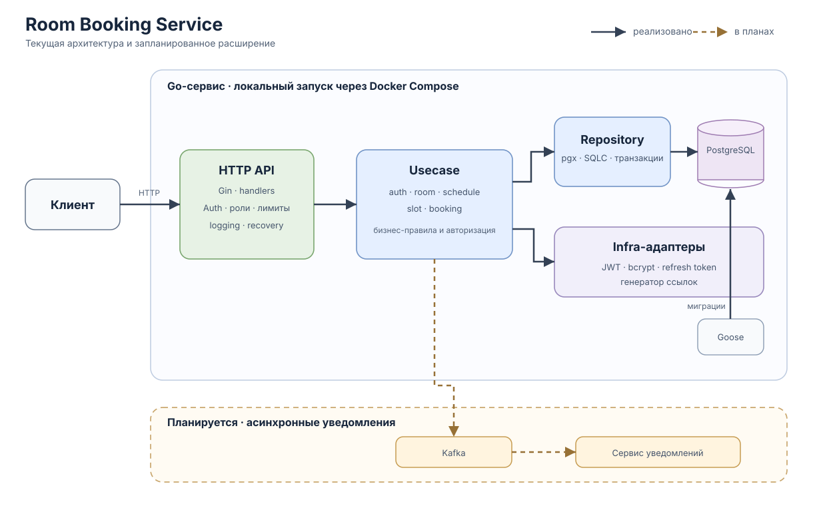

# Room Booking Service

## О проекте

Room Booking Service — backend для организации бронирования переговорных комнат. Администратор задаёт комнаты и правила их доступности, а сервис на их основе формирует слоты для выбранной даты и не позволяет нескольким пользователям забронировать одно и то же время.

Проект моделирует типичный внутренний сервис компании: пользователи бронируют подходящую переговорную, а администраторы управляют доступностью помещений.

## Статус проекта

Реализованы основной сценарий бронирования переговорных, HTTP API, аутентификация и ролевая авторизация пользователей. Написаны unit-тесты usecase-слоя и интеграционные тесты PostgreSQL repository-слоя. Проект развивается в направлении дальнейшего тестирования, observability, автоматизации развёртывания и асинхронных уведомлений.

В разработке:

- HTTP integration- и end-to-end тесты, в том числе для auth и middleware.
- Observability: метрики, tracing, дашборды и алерты.
- DevOps-часть: CI/CD и конфигурация развёртывания.
- Отдельный notifications-сервис с Kafka для асинхронной обработки событий бронирования.

## Возможности

- Регистрация и вход по email и паролю.
- Аутентификация через JWT access tokens, обновление токенов с ротацией refresh token.
- Управление сессиями: выход из текущей сессии или со всех устройств.
- Ролевой доступ для пользователей и администраторов, проверка владельца при отмене бронирования.
- Управление переговорными комнатами и повторяющимися расписаниями.
- Генерация свободных слотов на выбранную дату по запросу.
- Создание и отмена бронирований, просмотр будущих бронирований пользователя.
- Опциональная локальная генерация ссылок на конференции.
- Контракт API: [api.yaml](api.yaml).

## Архитектура и ключевые решения



На схеме сплошные связи обозначают работающие компоненты одного Go-сервиса; пунктиром показано планируемое расширение. Kafka и сервис уведомлений пока не реализованы.

- **Слоистая архитектура.** Бизнес-сущности и use case изолированы от HTTP, PostgreSQL и внешних адаптеров. Зависимости направлены внутрь: `entity` → `usecase` ← `repository` / `infra` / `controller`.
- **Явные бизнес-зависимости.** Use case зависят от небольших интерфейсов уровня приложения; конкретные реализации PostgreSQL, password hashing, JWT и conference links собираются в `internal/app`.
- **PostgreSQL, Goose и SQLC.** Изменения схемы версионируются миграциями Goose, а SQLC генерирует типобезопасный Go-код по SQL-запросам.
- **Транзакции для составных операций.** Создание расписания с правилами и получение страницы бронирований вместе с общим количеством выполняются через транзакционную абстракцию.
- **Аутентификация и сессии.** Пароли хешируются bcrypt. Короткоживущий access JWT подписывается HS256 и проверяется по подписи, сроку действия, issuer и audience. Refresh token передаётся в HttpOnly cookie; в PostgreSQL хранится только его хеш. Обновление выполняется с атомарной ротацией refresh token. Выход отзывает серверную сессию и запрещает дальнейшее обновление токенов; уже выданный access token действует до истечения TTL.
- **Авторизация на уровне бизнес-логики.** Middleware проверяет access token и формирует `entity.Identity`. Handler передаёт identity явным аргументом в use case, где проверяются роль и права на конкретную операцию. Проверки ролей в middleware обеспечивают ранний отказ.
- **Ограничение нагрузки.** Публичные auth-маршруты используют общий лимит запросов на экземпляр приложения. Получение слотов ограничивается по пользователю и числу одновременно выполняемых запросов.
- **Структурированное request-scoped логирование.** Zap-логи обогащаются `request_id`; после аутентификации в них также добавляются ID и роль пользователя. Проверенная identity и request-scoped logger передаются через стандартный request context до handler; бизнес-методы получают identity явно.
- **Эксплуатационная готовность.** HTTP-сервер поддерживает request ID, access logging, recovery после panic, настраиваемые timeouts, health endpoint (`/_info`) и graceful shutdown.

## Тестирование

- **Unit:** табличные тесты usecase-сервисов `auth`, `room`, `schedule`, `slot` и `booking` с моками зависимостей. Запуск: `make test-unit`.
- **Integration:** тесты PostgreSQL repository проверяют реальные SQL-запросы, миграции, ограничения БД, преобразование ошибок, выборки и транзакционные сценарии. Они работают с отдельной тестовой БД; запуск: `make test-repository`.
- `make test` запускает обычный Go-набор без repository integration-тестов: последние включаются отдельным build tag и требуют PostgreSQL.

Следующий шаг — HTTP integration- и end-to-end сценарии: аутентификация, refresh/logout, проверки ролей и middleware, а также полный путь от HTTP-запроса до БД. 

## Технологии

| Категория | Решения | Назначение |
| --- | --- | --- |
| Язык и HTTP | Go, Gin | Реализация сервиса и HTTP API |
| База данных | PostgreSQL, pgx | Хранение данных и работа с PostgreSQL |
| Работа со схемой и SQL | Goose, SQLC | Версионирование схемы и типобезопасные SQL-запросы |
| Аутентификация | JWT, bcrypt | Выпуск токенов и безопасное хранение паролей |
| Логирование | Zap | Структурированные application и request-scoped логи |
| Локальная инфраструктура | Docker Compose | Локальный запуск API, PostgreSQL и миграций |

## Структура проекта

```text
room-booking-service/
├── cmd/                 # точки входа приложения и миграций
├── db/                  # миграции Goose и SQLC-запросы
└── internal/
    ├── app/             # композиция зависимостей и жизненный цикл приложения
    ├── entity/          # бизнес-сущности
    ├── usecase/         # бизнес-логика уровня приложения и порты
    ├── repository/      # репозитории PostgreSQL
    ├── infra/           # технические адаптеры: PostgreSQL, JWT, bcrypt, logging
    └── controller/      # HTTP handlers, DTO, router и middleware
```
